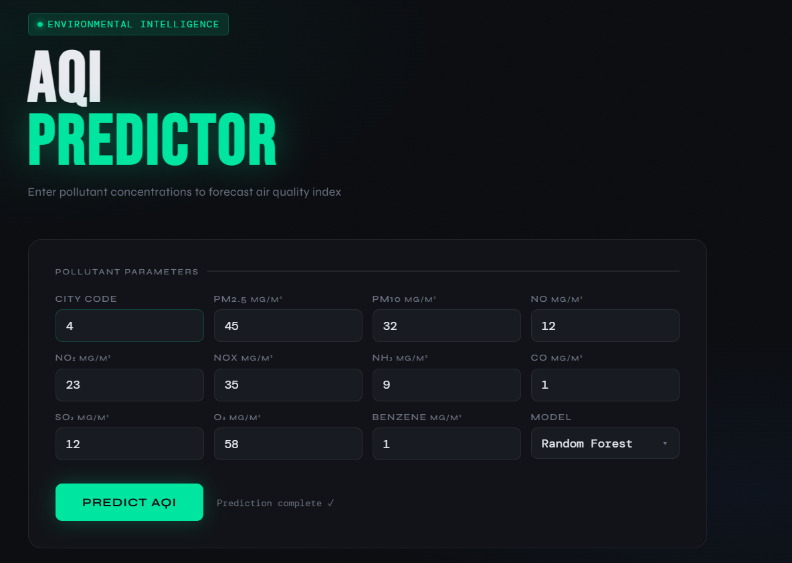
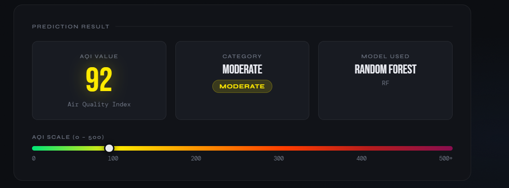
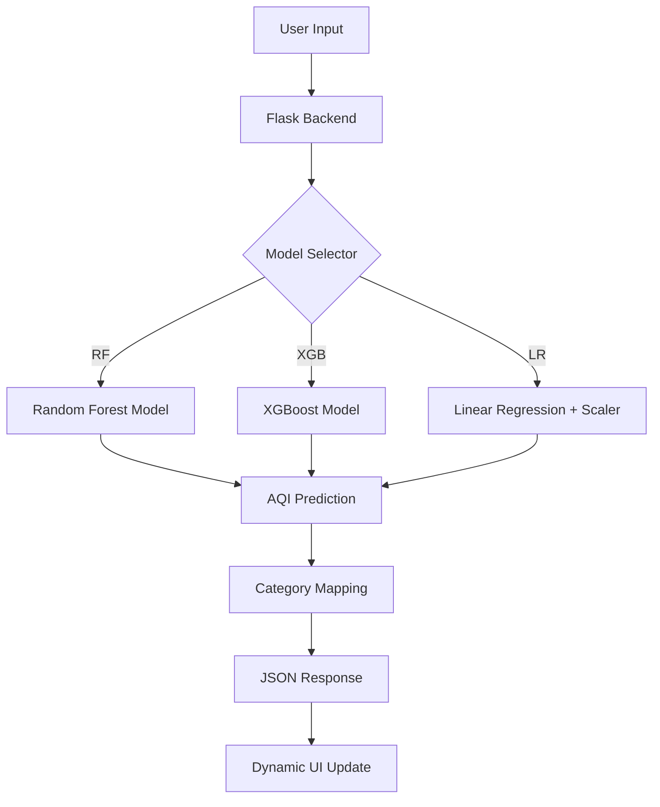

# 🌬️ AQI Prediction & Analysis System

> **Empowering Environmental Awareness with AI-Driven Air Quality Forecasting.**

[]()
[](https://opensource.org/licenses/MIT)
[](https://www.python.org/downloads/)
[]()
[]()

---

### 📖 Description / Overview
In an era of rising urbanization and industrialization, air pollution has become a critical global health concern. This project provides a **comprehensive end-to-end solution** for predicting the **Air Quality Index (AQI)** using machine learning. 

By analyzing the concentration of key pollutants (PM2.5, PM10, NO2, CO, etc.), the system provides high-precision forecasts, helping citizens and authorities make informed decisions. It bridges the gap between raw environmental data and actionable health insights through a modern, high-performance web interface.

---

### 📸 Demo / Screenshots

| Landing & Input Dashboard | Real-time Prediction Output |
| :--- | :--- |
|  |  |

---

### 🔗 Links
- **Live Demo:** https://aqi-prediction-analysis-system.onrender.com/
- **Repository:** https://github.com/Ayush-Ranjane/AQI-Prediction-Analysis-System.git

---

### ✨ Features
- **🚀 Multi-Model Prediction:** Choose between **Random Forest**, **XGBoost**, and **Linear Regression** for tailored accuracy.
- **📊 Granular Pollutant Analysis:** Processes 11 distinct parameters including PM2.5, PM10, NOx, CO, O3, and Benzene.
- **🎨 Modern UI/UX:** A stunning dark-mode dashboard with real-time feedback and glassmorphic design elements.
- **⚡ Fast Inference:** Optimized model serialization using `pickle` for near-instantaneous results.
- **📍 City-Specific Insights:** Context-aware forecasting based on localized historical data.
- **📱 Fully Responsive:** Seamless experience across desktop, tablet, and mobile devices.

---

### 🏗️ System Architecture


---

### 🛠️ Tech Stack

**Frontend**
- **Core:** HTML5, Modern CSS3 (Vanilla)
- **Design:** Glassmorphism, Responsive Grid
- **Fonts:** Syne, Bebas Neue, DM Mono

**Backend**
- **Framework:** Flask (Python)
- **Server:** Gunicorn (Production ready)

**Machine Learning**
- **Modeling:** XGBoost, Scikit-Learn (Random Forest, Linear Regression)
- **Data:** NumPy, Pandas
- **Pre-processing:** StandardScaler

**Tools & DevOps**
- **Deployment:** Heroku / Render (via `Procfile`)
- **Environment:** Dotenv (`.env`)

---

### 🚀 Installation & Setup

1. **Clone the Repository**
   ```bash
   git clone https://github.com/[YOUR_USERNAME]/[REPO_NAME].git
   cd [REPO_NAME]
   ```

2. **Create Virtual Environment**
   ```bash
   python -m venv venv
   source venv/bin/activate  # On Windows: venv\Scripts\activate
   ```

3. **Install Dependencies**
   ```bash
   pip install -r requirements.txt
   ```

---

### 🔑 Environment Variables
Create a `.env` file in the root directory and add the following:
```env
FLASK_APP=app/app.py
FLASK_ENV=development
SECRET_KEY=[YOUR_SECRET_KEY_HERE]
```

---

### 🏃 Usage / How to Run
Start the development server:
```bash
python app/app.py
```
Visit `http://127.0.0.1:5000` in your browser to interact with the application.

---

### ⚙️ How It Works (Pipeline)
1. **Data Ingestion:** User inputs pollutant levels through the UI.
2. **Preprocessing:** Data is converted to a NumPy array; if Linear Regression is chosen, a pre-trained `scaler.pkl` is applied.
3. **Model Inference:** The selected `.pkl` model predicts the raw AQI value.
4. **Classification:** The raw value is categorized into status levels (Good, Moderate, Poor, etc.) based on standard environmental benchmarks.
5. **Visualization:** The UI dynamically updates the AQI scale and color-coded results.

---

### 📡 API Endpoints

| Endpoint | Method | Description |
| :--- | :--- | :--- |
| `/` | `GET` | Renders the main dashboard interface. |
| `/predict` | `POST` | Accepts JSON pollutant data and returns AQI prediction. |

---

### 🧠 Model Details
- **Random Forest:** Best for handling non-linear relationships in environmental data.
- **XGBoost:** Highly efficient gradient boosting for maximum accuracy.
- **Linear Regression:** Provides a baseline reference for pollutant trends.

---

### 📁 Folder Structure
```text
.
├── Data/               # Raw and processed datasets
├── Models/             # Trained .pkl models & scalers
├── Nootbooks/          # Jupyter notebooks for training
├── app/
│   ├── app.py          # Flask application logic
│   └── templates/      # HTML UI (index.html)
├── requirements.txt    # Project dependencies
├── Procfile            # Deployment configuration
└── .env                # Environment variables
```

---

### 🔮 Future Improvements
- [ ] Integration with real-time IoT sensors for live city monitoring.
- [ ] Time-series forecasting for 24-hour AQI predictions.
- [ ] User authentication and historical tracking dashboard.
- [ ] Mobile application using Flutter/React Native.


---

### 👤 Author / Contact
**Ayush Ranjane**
- **LinkedIn:** https://www.linkedin.com/in/ayush-ranjane-61051b303/
- **Portfolio:** https://portfolio-seven-beta-vt5k5cpfg7.vercel.app/
- **Email:** ayushranjane@gmail.com

---
<p align="center">Made with ❤️ for a Greener Planet</p>
